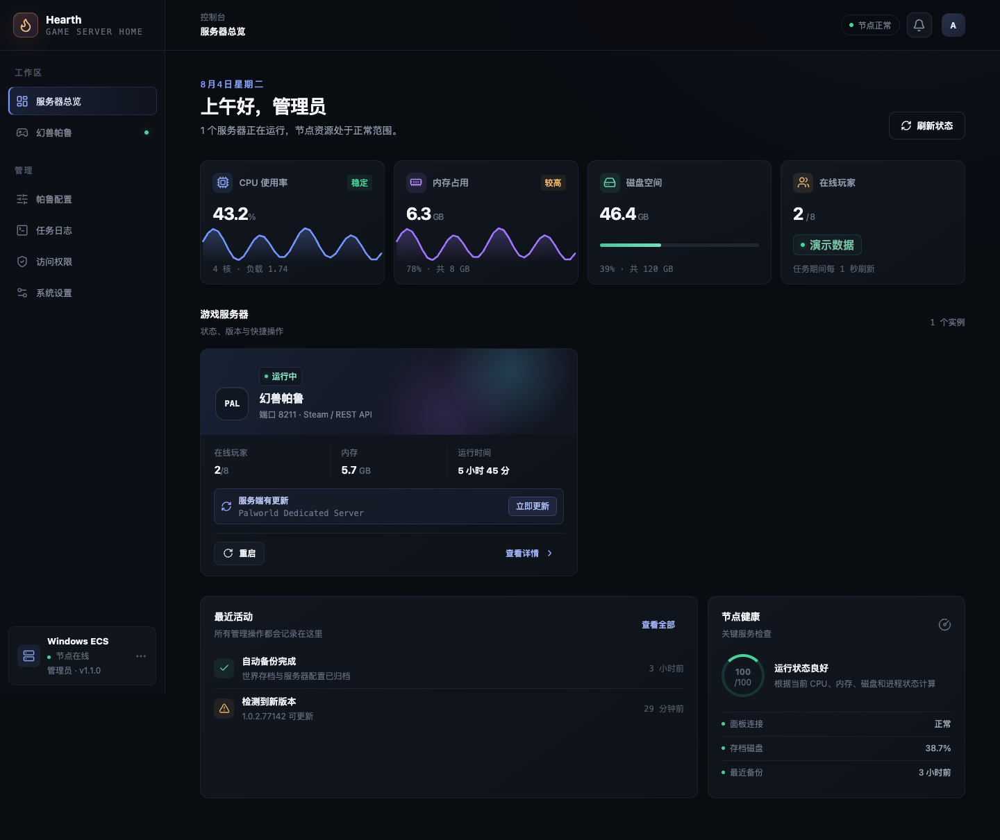

<p align="center">
  <strong>简体中文</strong>&nbsp;&nbsp;|&nbsp;&nbsp;<a href="README.en.md">English</a>
</p>

<p align="center">
  
</p>

<p align="center">
  面向小型自托管服务器的轻量游戏服控制台。<br />
  让朋友只用一个网址和密码，就能查看状态、更新版本或安全重启服务器。
</p>

<p align="center">
  <code>Go</code>&nbsp;&nbsp;·&nbsp;&nbsp;<code>Vue 3</code>&nbsp;&nbsp;·&nbsp;&nbsp;<code>Windows Server</code>&nbsp;&nbsp;·&nbsp;&nbsp;<code>Palworld 1.0</code>
</p>

---



## Hearth 是什么

Hearth 把前端和 API 合并为一个 Go 二进制，直接管理现有的 SteamCMD 游戏安装，
不要求 Docker，也不迁移存档。它目前专注于 Windows 上的幻兽帕鲁服务器；饥荒联机版
保留为后续适配器。

适合这样的场景：

- 只有几位固定朋友，不需要复杂的托管平台。
- 游戏已经安装并拥有现有存档。
- 希望朋友能自行更新、重启或备份，不再等待服主远程操作。
- 需要清楚的权限边界，但不想引入数据库和账号系统。

## 能力

| 范围 | 当前实现 |
| --- | --- |
| 游戏生命周期 | 启动、安全停止、重启、SteamCMD 更新、ZIP 备份和阶段进度 |
| 帕鲁配置 | 分源读取和增量保存 `WorldOption.sav` / `PalWorldSettings.ini`，显示重复项冲突 |
| 状态监控 | CPU、内存、磁盘、进程、版本、按需检查 Steam public 分支、存档 ID、在线玩家和运行时间 |
| 访问控制 | 一个管理员密码、最多 20 个无用户名成员密码、权限模板、渐进限流与 IP 黑白名单 |
| 审计 | 管理员可查看最近任务活动、任务日志、登录/攻击审计、IP 规则变更和参数审计；不记录密码明文 |
| 部署 | 单文件 Windows 程序、计划任务自启动、版本化安装包 |

### 权限模型

| 操作 | 管理员 | 成员密码 |
| --- | :---: | :---: |
| 查看状态 | ✓ | 始终允许 |
| 启动、停止、重启 | ✓ | 可勾选 |
| 更新服务端 | ✓ | 可勾选 |
| 创建存档备份 | ✓ | 可勾选 |
| 修改帕鲁日常玩法参数 | ✓ | 可勾选 |
| 修改系统/安全参数与 `WorldOption.sav` | ✓ | — |
| 管理成员密码 | ✓ | — |
| 查看任务日志、IP 黑白名单与两类审计 | ✓ | — |

新成员默认只读。管理员可选“只读、日常管理、服主管理”模板，再调整具体勾选项。
成员密码使用随机盐和 PBKDF2-SHA256 摘要保存；前端按权限隐藏或禁用入口，后端仍会
独立校验每次请求。删除成员或修改其密码、权限时，该成员现有会话会立即失效。

“修改帕鲁玩法参数”使用服务端白名单，只开放服务器名称/描述/人数、时间与经验倍率、
捕获与采集倍率、难度、死亡惩罚、随机化、语音、快速传送、玩家列表和禁用科技列表。
密码、REST/RCON、跨平台、模组、性能/磁盘参数、未知高级参数及完整
`WorldOption.sav` 始终只允许管理员操作。旧版 `palworld.settings` 成员权限升级后会
自动收敛为这项玩法权限，不会继续保留过宽访问。

主页“最近活动”和完整任务日志保持管理员专属。成员不会看到历史活动列表，但仍会在
总览和游戏详情页看到其有权发起的当前任务阶段与进度。最近活动只保留在当前 Hearth
进程内，重启面板后会清空；需要长期排障时请查看磁盘上的任务日志。

每次成功保存 `PalWorldSettings.ini` 后，后端会根据保存前后的结构化结果计算真实变化，
记录时间、操作者、来源 IP、配置版本和参数前后值。敏感参数只记录“已修改”，不写入值。
记录保存在 `config-audit.jsonl`，达到 5 MiB 后轮转并保留一代；管理员可在“访问权限 →
参数审计”查看最近 1000 条。`WorldOption.sav` 目前保持管理员专属，但不做逐参数审计。
登录审计文件同样在 5 MiB 时轮转，避免长期运行无限占用磁盘。

登录保护采用按来源自适应退避：普通来源连续失败 5 次后从 1 秒开始逐步延长，最长
5 分钟；已签名的可信设备和 IP 白名单使用独立的保留校验通道与更宽阈值，避免外部攻击
完全占满正常用户的密码校验能力。这里的“可信”只影响限流，不是免密登录：页面仍会要求
输入管理员或成员密码，设备 Cookie 本身不能访问任何已认证 API。密码摘要校验的并发数
也有固定上限，避免 PBKDF2 被大量并发请求拖垮。

达到攻击阈值后，登录审计会明确标记“疑似自动化登录尝试”或“疑似暴力破解”。管理员
可以在记录右侧三点菜单将精确 IP 快速加入黑名单 24 小时或白名单 7 天，也可以在
“IP 黑白名单”页设置 1 小时至 365 天或永久规则。黑名单在密码计算前拒绝请求；白名单
仍必须输入正确密码。规则变更也写入同一审计记录。

Hearth 只接受来自 `trustedProxyCidrs` 中代理的 `X-Forwarded-For` 和
`X-Forwarded-Proto`，并从代理链右侧解析真实客户端地址。默认只信任本机回环地址，
适合反向代理与 Hearth 同机部署。若代理在另一台机器上，应只加入该代理的固定地址或
最小 CIDR，不能写成 `0.0.0.0/0`；否则客户端可能伪造来源 IP 和 HTTPS 标记。

## Windows 快速安装

要求：

- Windows Server 2022 或兼容版本
- 已安装 SteamCMD 和 Palworld Dedicated Server
- 管理员 PowerShell

构建安装包：

```bash
make windows-package
```

解压生成的 `hearth-windows-amd64-v<版本号>.zip`，确保这些文件位于同一目录：

```text
hearth.exe
install-windows.ps1
uninstall-windows.ps1
VERSION
THIRD_PARTY_NOTICES.md
THIRD_PARTY_NOTICES.zh-CN.md
```

在管理员 PowerShell 中运行：

```powershell
Set-ExecutionPolicy -Scope Process Bypass
.\install-windows.ps1
```

安装器输入的是 Hearth 管理员密码，与帕鲁的 `AdminPassword` 相互独立。安装器只安装
Hearth 和启动任务，不会停止、启动、更新或修改正在运行的 Palworld。

## 第一次接管 Palworld

1. 在现有方式下正常保存并关闭游戏。
2. 安装 Hearth，在 ECS 内打开 `http://127.0.0.1:8080`。
3. 从 Hearth 启动服务器；启动本身不依赖 REST API。
4. 如果需要玩家数据以及运行中的安全停止、重启、更新和备份，再进入 INI 配置来源，
   设置非空 `AdminPassword`、启用 `RESTAPIEnabled` 并确认 `RESTAPIPort=8212`。

Hearth 固定从 `127.0.0.1` 访问 Palworld REST API。REST 不可用时仍允许启动，
停止和重启会在明确提示存档风险并再次确认后，先尝试安全关闭，再回退为终止当前识别到的
Palworld 进程。运行中的更新和备份仍要求 REST API，绝不会自动退化为强制结束进程。

成功创建 ZIP 后，Hearth 会清理自身命名的旧备份：默认删除超过 30 天的文件，并从最旧
文件开始继续清理，直到这些备份合计不超过 20 GiB。刚创建成功的备份始终保留；手工命名
或其他程序生成的文件不在清理范围内。阈值可通过 `backupRetentionDays` 和
`backupMaxTotalGB` 调整。

完整流程见 [Windows 帕鲁部署指南](docs/windows-palworld.md)。

## 检查 Palworld 新版本

Palworld 详情页在“当前版本”旁显示版本检查状态。点击“检查新版本”后，Hearth 会把检查
作为普通串行任务执行：SteamCMD 只刷新 App ID `2394010` 的应用信息，不修改服务端文件；
面板随后比较本机 manifest 与 Steam public 分支的 Build ID。

检查需要“更新服务端”权限。若已有其他 SteamCMD 或 Hearth 任务正在执行，面板会拒绝
并发检查。结果只缓存在当前 Hearth 进程中；面板重启或本机 Build ID 变化后需重新检查。
这样避免了空闲状态后台启动 SteamCMD，也不会把第三方版本站点变成运行依赖。

正式更新时，SteamCMD 启动阶段会先检查并按需更新自身。Hearth 把日志持续增长视为进展，
所以自身更新、下载和校验不会触发误超时；默认连续 30 分钟没有任何日志进展才终止
SteamCMD 进程树并提示重试。若 SteamCMD 在自更新后正常退出但还没有确认 Palworld 更新
完成，Hearth 会自动重试一次，并且只有看到 App ID `2394010` 的成功标志才会宣布完成。

## 本地开发

要求 Go 1.26+、Node.js 22+ 和 pnpm 10+。

```bash
pnpm --dir web install
make dev-api
make dev-web
```

演示环境地址为 `http://127.0.0.1:5173`，密码为 `admin`。

生产构建：

```bash
make build
```

产物位于 `bin/hearth`。本地演示也可以直接运行：

```bash
HEARTH_DEMO=true HEARTH_ADMIN_PASSWORD='replace-me' ./bin/hearth
```

## 项目边界

- 当前生产适配器只支持 Windows Palworld 1.0。
- 不执行来自前端的任意 Shell 文本。
- 同一游戏同时只运行一个变更任务。
- 不在后台主动启动 SteamCMD；版本检查由用户按需触发。
- 不长期保存监控时间序列或版本检查结果。
- 运行中的世界规则可以查看和编辑，但必须安全停服后才能写入。
- 不明确识别存档时拒绝猜测，不绑定固定世界 ID。

## 文档

- [Windows 帕鲁部署与升级](docs/windows-palworld.md)
- [架构与安全边界](docs/architecture.md)
- [版本变更记录](CHANGELOG.md)
- [第三方组件声明](THIRD_PARTY_NOTICES.zh-CN.md)

公网入口属于部署层能力，不由 Hearth 配置或维护。如需让朋友访问，推荐在面板外使用
Tailscale Funnel 等 HTTPS 入口；不要直接向公网开放 Hearth 的 8080 或 Palworld REST
API 的 8212 端口。
